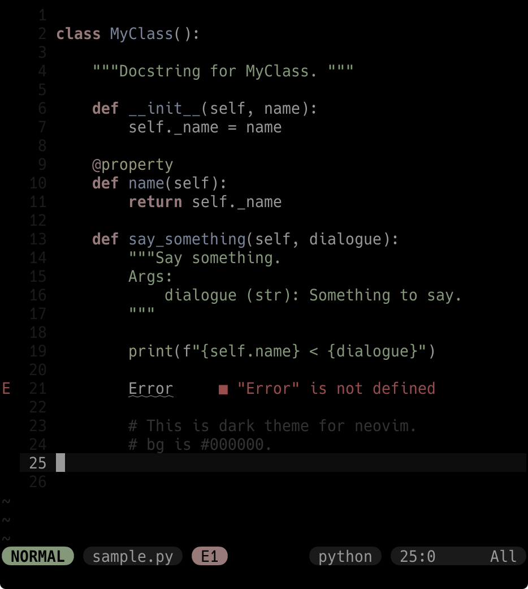

# neg.vim

<div align="center"



</div>

## Note
Custom as you like.
```viml
func! s:color_setup() abort
    hi Normal guifg=#ffffff
endfunc

augroup my_group | au!
    au ColorScheme neg call s:color_setup()
augroup END

colorscheme neg
```
